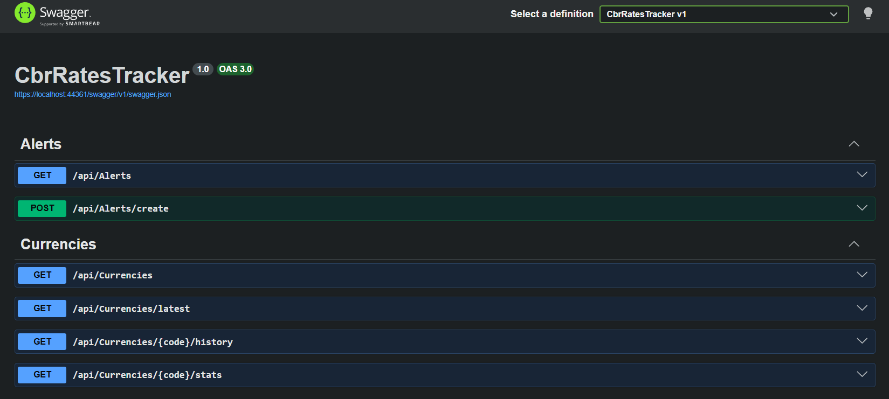
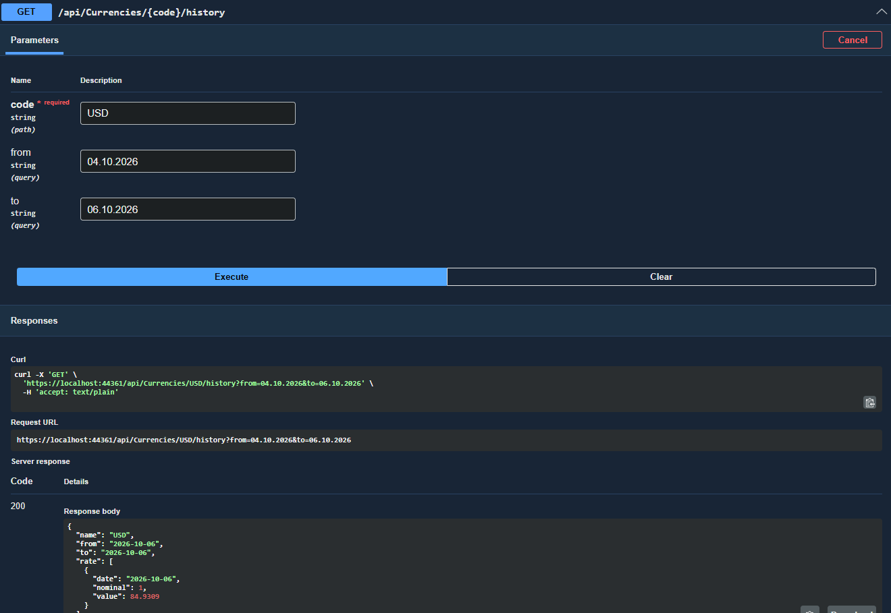
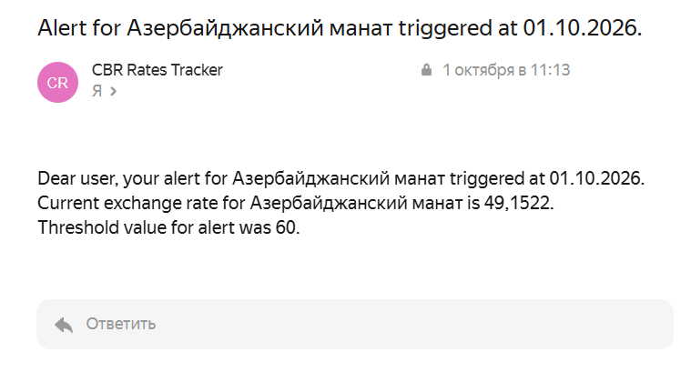
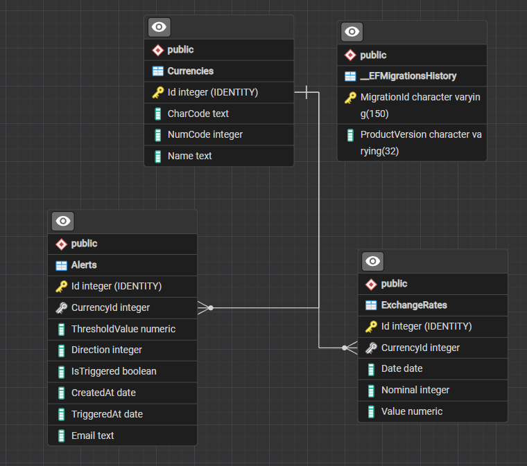

# CBR Rates Tracker

> Web API, которое собирает официальные курсы валют ЦБ РФ, хранит историю и уведомляет о достижении порога.

Это pet-проект для портфолио, демонстрирующий интеграцию с внешним API, фоновые задачи и работу с историческими данными.

---

## О проекте

У Центробанка РФ есть открытый API с официальными курсами валют - он отдаёт данные в XML раз в день. Сервис забирает эти данные в фоновой задаче, парсит их и сохраняет в БД, накапливая полную историю по каждой валюте. Пользователь может посмотреть, как менялся курс за выбранный период, увидеть min/max/средний курс валюты, а также настроить алерт — правило вида «уведоми, когда курс валюты X перевалит за Y» — и получить email, когда условие выполнится.

---

## Стек технологий

- .NET 10
- EF Core 10
- PostgreSQL 18
- Serilog 4.4
- MimeKit 4.18.1
- Swagger 10.2.3

---

## Функциональность

- Автоматический сбор курсов раз в сутки
- Хранение полной истории курса валюты
- История за выбранный период + min/max/средний курс валюты
- Создание алертов на пороговое значение курса валюты
- Email-уведомления при достижении порога

---

## Структура проекта
- `CbrRatesTracker/Controllers` — эндпоинты API
- `CbrRatesTracker/Services` — бизнес-логика
- `CbrRatesTracker/Interfaces` — интерфейсы для сервисов
- `CbrRatesTracker/Models` — сущности EF Core
- `CbrRatesTracker/DTO` — DTO-классы
- `CbrRatesTracker/BackgroundJobs` — фоновые задачи
- `CbrRatesTracker/CbrIntegrations` — интеграции с ЦБ РФ (загрузка XML, парсинг)

---

## Как запустить локально

### Требования

- .NET 10 SDK
- PostgreSQL 18
- SMTP-аккаунт для отправки email-уведомлений (подойдет и тестовый)

### Шаги по установке

1. Клонировать репозиторий
   ```bash
   git clone https://github.com/Raff4enskii25/cbr-rates-tracker-api.git
   cd cbr-rates-tracker-api/CbrRatesTracker
   ```

2. Настроить User Secrets
   ```bash
   dotnet user-secrets init
   dotnet user-secrets set "ConnectionStrings:DefaultConnection" "Host=localhost;Database=CbrRatesTracker;Username=postgres;Password=your_password"
   dotnet user-secrets set "Cbr:XmlDailyUrl" "https://www.cbr.ru/scripts/XML_daily.asp"
   dotnet user-secrets set "EmailSettings:SenderName" "CBR Rates Tracker"
   dotnet user-secrets set "EmailSettings:SenderEmail" "your-email@example.com"
   dotnet user-secrets set "EmailSettings:Server" "smtp.example.com"
   dotnet user-secrets set "EmailSettings:Port" "465"
   dotnet user-secrets set "EmailSettings:Password" "your-smtp-password"
   ```
   > Если не настроить `EmailSettings` — приложение всё равно запустится и будет работать: алерты будут создаваться и помечаться сработавшими, просто письма отправляться не будут (ошибка отправки логируется и не прерывает остальную логику).

3. Применить миграции
   ```bash
   dotnet ef database update
   ```

4. Запустить
   ```bash
   dotnet run
   ```

5. Открыть Swagger UI
   ```
   https://localhost:xxxx/swagger
   ```

---

## API Эндпоинты

| Метод | Путь | Описание |
|---|---|---|
| GET | `/api/currencies` | Список всех отслеживаемых валют |
| GET | `/api/currencies/latest` | Курсы на последнюю доступную дату |
| GET | `/api/currencies/{code}/history?from=&to=` | История курса валюты за период (даты в формате dd.MM.yyyy) |
| GET | `/api/currencies/{code}/stats?from=&to=` | Min/max/среднее по курсу валюты за период |
| POST | `/api/alert/create` | Создать алерт на пороговое значение курса |
| GET | `/api/alert?currency=&isTriggered=` | Список алертов с фильтрацией по валюте и статусу срабатывания |

---

## Скриншоты

### Swagger UI — список эндпоинтов


### Пример ответа — история курса валюты


### Email-уведомление при срабатывании алерта


### Схема базы данных


---

## Особенности реализации

- **Защита от дублей при повторном обновлении.** Фоновая задача может запускаться несколько раз в сутки. Перед вставкой одним запросом получаются уже сохранённые даты и помещаются в `HashSet`, что позволяет пропустить существующие записи.
- **Создание scope внутри `BackgroundService`.** `BackgroundService` зарегистрирован как Singleton, а `AppDbContext` — как Scoped. Для получения актуального `DbContext` на каждом запуске через `IServiceScopeFactory` создаётся новый scope.
- **Нормализация курса по номиналу** — ЦБ иногда публикует курс не за 1 единицу валюты, а за номинал (например, за 100 йен). Все сравнения, включая проверку алертов и агрегаты (min/max/avg), считаются как `Value / Nominal`, иначе сравнение курсов между разными датами было бы некорректным.
- **Инкапсуляция состояния алерта.** Изменение статуса срабатывания выполняется только через метод `SetAlertIsTriggered(...)`. Установить некорректное состояние снаружи невозможно.
- **Разделение сервисов на чтение и запись** — обновление курсов (`ExchangeRateUpdateService`) и чтение/аналитика (`ExchangeRateQueryService`) вынесены в разные сервисы, так как у них разные причины для изменения.

---

## Что можно улучшить

- Привязка алертов к конкретному пользователю.
- `DELETE`/`PUT` эндпоинты для управления алертами.
- Периодическая повторная проверка алерта, пока условие продолжает выполняться, а не только разовое срабатывание.
- Дополнительные каналы отправки уведомлений.

---